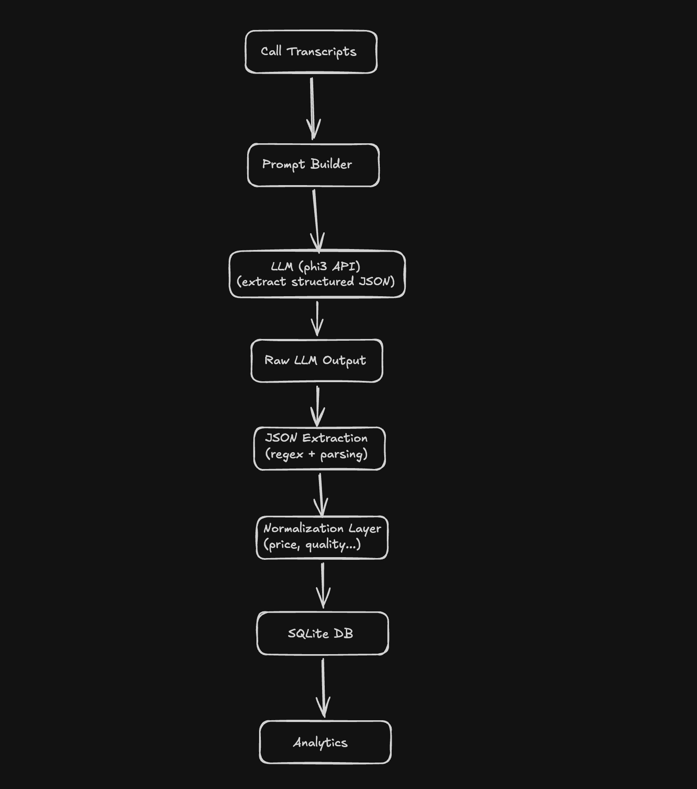

# AI Sales Call Intelligence

## Overview
This project demonstrates an end-to-end AI pipeline for extracting structured business insights from unstructured sales call transcripts using a local LLM (phi3).

The system converts raw conversation text into actionable data such as:
- Company name
- Customer objections
- Intent (interested / not_interested / neutral)

---

## Architecture


Input (call transcript)
→ LLM (phi3 via API)
→ JSON extraction
→ Normalization layer
→ SQLite storage
→ Analytics

---

## Pipeline Flow

1. Raw transcript is passed to LLM
2. LLM returns semi-structured JSON (often noisy)
3. Parser extracts valid JSON
4. Data is normalized (e.g. "price is too high" → "price")
5. Data is stored in SQLite
6. Analytics layer aggregates insights

---

## Example

### Input
"Client ABC Corp says price is too high but interested"

### Output
```
"company": "ABC Corp",
"objection": "price",
"intent": "interested"
```

## Analytics

Example outputs:

Top objections:
- price
- quality
- timing

Intent distribution:
- interested
- not_interested
- neutral


### Tech Stack

- Python
- LLM (phi3 via Ollama API)
- SQLite
- requests
- Regex-based JSON parsing

## Key Challenges Solved
- Handling inconsistent LLM output (extra text, broken JSON)
- Extracting structured data from unstructured conversations
- Normalizing free-text objections into categories
- Building a full pipeline (not just calling an LLM)

## How to Run
python app.py
python analytics.py

## Project Structure
```
ai-sales-call-intelligence/
│
├── app.py
├── llm.py
├── prompts.py
├── db.py
├── analytics.py
│
├── README.md
├── requirements.txt
└── architecture.png
```

## Future Improvements
- FastAPI endpoint (/analyze_call)
- RAG for company enrichment
- Vector database for semantic search
- Dashboard (Streamlit / BI tool)


## Use Case
- This pipeline can be used to:
- Analyze sales calls at scale
- Identify recurring objections
- Measure customer intent trends
- Support sales and operations teams with data-driven insights
